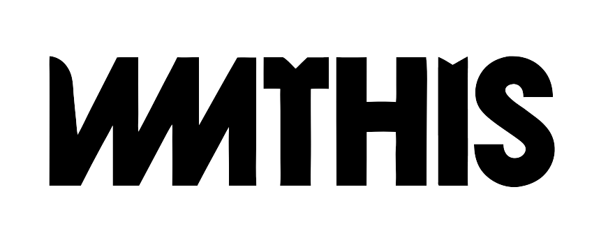

  

---

 

🏃🏻‍♀️ [WHTHIS 데모 사이트 바로가기](https://www.wmthis.n-e.kr) 💨

 

---

#  팀원 구성

  <table>
    <tr>
      <th>서찬영</th>
      <th>천태훈</th>
      <th>오승재</th>
      <th>김유진</th>
    </tr>
    <tr>
      <td></td>
      <td></td>
      <td></td>
      <td></td>
    </tr>
    <tr>
      <td><a href="https://github.com/chan0o0seo">@chan0o0seo</a></td>
      <td><a href="https://github.com/taehoon0518">@taehoon0518</a></td>
      <td><a href="https://github.com/dhtmdwo">@dhtmdwo</a></td>
      <td><a href="https://github.com/kuj7882">@kuj7882</a></td>
    </tr>
  </table>

 

---

# 🔧 기술 스택

### Frontend

&nbsp;
&nbsp;
&nbsp;
&nbsp;
&nbsp;

### DevOps

&nbsp;
&nbsp;

### CI/CD

&nbsp;
&nbsp;
&nbsp;
&nbsp;

### Monotoring

&nbsp;
&nbsp;

### Test&VCS

&nbsp;
&nbsp;

### Cooperation

&nbsp;
&nbsp;
&nbsp;

 

---

# 🔮 프로젝트 소개

## **WMTHIS: 효율적인 재고 및 영업 관리 솔루션**

**WMTHIS** 솔루션은  
📊 **매출 데이터 기반의 영업 관리**와  
📦 **체계적인 재고 관리**를 제공합니다.

이를 통해 **남는 재료를 인근 매장과 쉽게 공유**하여  
✅ **폐기율을 낮추고**  
✅ **원가 절감 효과**를 기대할 수 있습니다.

---

### **자동 재고 관리 시스템**

- 메뉴 판매 시 **레시피에 명시된 정량**에 따라 **재료 소비량을 자동 측정**
- **남은 재료를 실시간 업데이트**하여 **체계적으로 관리 가능**

 

> 📌 **수작업 없이도 재료 관리가 더욱 정확하고 효율적!**

 

- 주문 및 **결제 완료 후**, 레시피에 맞는 **정량만큼 재고가 자동으로 차감**됩니다.
- 자동 차감을 위해, **재고 기준 등록 → 재고 입고 등록** 순서로 세팅이 필요합니다.

 

> ✅ **재고 관리 탭에서 기준을 등록**하면,
>
> - 카테고리 및 옵션 항목에서 **레시피에 따른 정량 사용**이 가능하며
> - **재고 등록 탭**에서 입고된 수량 기준으로 정확한 재고 관리를 수행할 수 있습니다.

 

---

### **POS 기능으로 재고 자동화 관리**

- 메뉴 등록 시 POS기에서 바로 **주문 가능**

- 결제 완료와 동시에 자동으로 재고에서 **레시피 만큼 재고 차감**

- 카테고리와 하위 옵션 등록 시 각 옵션에 설정된 재료 사용량도 **자동으로 차감**되어 정밀한 재고 관리 가능

- 주문 내역 저장으로 **매출 정산도 자동화, 매출 추이나 베스트 메뉴 보기**

- 주문 데이터를 바탕으로 **시간대 매출 트렌드 분석**

- ✅ 실물 재고 확인, 주 1회로도 충분!

---

### **매장 관리 기능**

- 가게에서 사용하는 재고 기준만 등록해두면 **입고 기능이 간편해서 즉시 사용 가능**

- 유통기한이 가까운 재료부터 자동으로 먼저 소진되도록 설계되어 **불필요한 폐기 없이 효율적인 재고 운영 가능**

- 과발주나 판매 부진으로 남은 재료는 **장터 기능을 통해 다른 매장에 판매**, 부족한 재료는 **근처 매장에서 합리적인 가격에 구매 가능**

---

### **재료 공유 및 거래 시스템**

- 3km 이내의 가게들만 거래 게시물에 표시되어 근처 가게와의 빠르고 **효율적인 거래 가능**

✅ **재료가 남는 매장** → 남은 재료를 **폐기 없이 판매 가능**  
✅ **재료가 부족한 매장** → 필요한 재료를 **원하는 가격으로 제안하고 빠르게 거래 가능**

이 서비스를 통해 **불필요한 폐기물을 줄이고, 재료 수급을 최적화**할 수 있습니다.

 

결과적으로 `WHTHIS` 솔루션은 **재고 관리에 효율성을 높여 불필요한 비용을 줄이고, 매장의 수익성을 극대화할 뿐만 아니라 환경 보호에도 기여합니다.**

 

---

## ⚠️**서비스 이용 전 반드시 확인해 주세요**

### 📱 **휴대폰 인증 관련 설명**

휴대폰 인증의 경우, 여러 번 시도하면 요금이 발생할 수 있습니다.  
임시로 인증번호 확인창에 **휴대폰 인증 번호**가 나타나도록 설정해두었습니다.

### 📦 **재고 관리 관련 설명**

- 재고 관리를 위해서 **재고 관리** 탭에서 매장에서 사용할 재고 등록
- **재고 등록** 탭에서 입고 후에만 재고 사용 가능
- 유통기한이 얼마 남지 않은 상품은 총 보유량을 확인하여 빠르게 거래 등록 가능

### 🏬 **매장 관리 관련 설명**

- 메뉴 등록 시 카테고리를 설정할 수 있고 각 **카테고리에는 옵션을 추가 가능**

- 각 옵션에는 해당 **옵션으로 사용되는 재고량을 입력**

- 메뉴 등록 시 레시피 **정량에 맞게 입력하면 POS 주문 시 정량만큼 자동으로 재고 차감**

### 🧾 **POS 관련 설명**

- POS 주문 시 **재고 자동화 관리 및 매출 분석**

- POS 주문 시 **재고 부족한 경우 경고창**

---

# 🗂️ 프로젝트 기획

 

▶ [**🕙 WBS 바로가기**](https://docs.google.com/spreadsheets/d/1LdWS6icJXQ0v-Flu6HQHA01YwZ88RcX8zlemLsZBi1U/edit?gid=0#gid=0)

▶ [**📑 요구사항 정의서 바로가기**](https://docs.google.com/spreadsheets/d/16wSc1cXDfdekU2iw4pQBwFMDCW2UYdl9KT6ui1QOgOY/edit?gid=0#gid=0)

 

---

# 📜 프로젝트 설계

[**🎨 화면설계서 바로가기**](https://www.figma.com/design/UhQdny2lyLYVBKfeSDM0ER/Untitled?node-id=0-1&p=f&t=BJpdqml8x7np3fWT-0)

 

---

# 📚 기술 소개

> 자세한 내용은 Wiki에서 확인할 수 있습니다.

### ▶ [**Wiki 바로가기**](https://github.com/beyond-sw-camp/be12-fin-5verdose-WMTHIS-FE/wiki)

 

# ReadMe 바로가기

🔗 [Frontend](https://github.com/beyond-sw-camp/be12-fin-5verdose-WMTHIS-FE/blob/main/README.md)  
🔗 [Backend](https://github.com/beyond-sw-camp/be12-fin-5verdose-WMTHIS-BE/blob/main/README.md)  
🔗 [CI/CD](https://github.com/beyond-sw-camp/be12-fin-5verdose-WMTHIS-BE/tree/main/cicd/README.md)  

